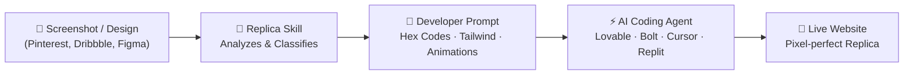
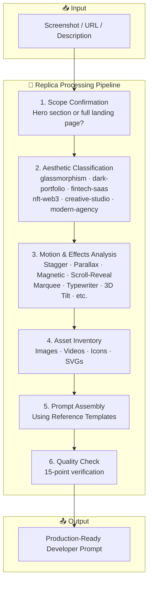
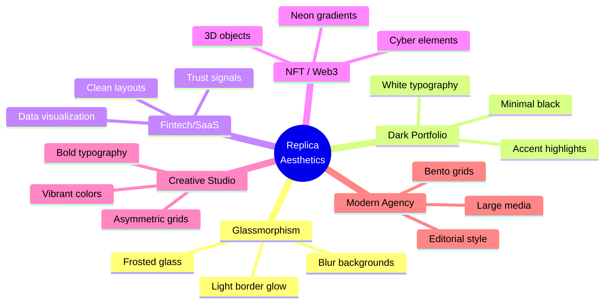

# Replica

> **Turn any screenshot or design reference into a precise, copy-paste-ready developer prompt** — with exact hex colors, Tailwind classes, animation specs, and component structure. Ready for Lovable, Bolt, Cursor, Replit, or any AI coding agent.

[](LICENSE)
[](https://github.com/Surya17155/Replica/stargazers)
[](https://github.com/Surya17155/Replica/issues)

---

## Demo



---

## What is Replica?

Replica is an **AI skill file** that acts as a bridge between visual design and code. Upload a screenshot (or describe a design), and Replica's structured knowledge base generates a production-grade developer prompt with:

- **Exact hex colors** — no vague "dark background"
- **Complete Tailwind CSS classes** — mobile-first, responsive
- **Full animation tuples** — initial state, animate state, duration, delay
- **Component architecture** — PascalCase names with file paths
- **Glassmorphism / gradient / shadow CSS** — complete blocks, not descriptions
- **Asset inventory** — what images/videos you need and where they go

---

## How It Works



---

## Quick Start

### Prerequisites

- An AI coding agent that supports **SKILL.md** files (Claude Code, Cursor, etc.)
- A screenshot/URL of a hero section or landing page design

### Step 1: Download

Clone the repository:

```bash
git clone https://github.com/Surya17155/Replica.git
```

Or [download the ZIP](https://github.com/Surya17155/Replica/archive/refs/heads/main.zip).

### Step 2: Install the Skill

| AI Agent | How to Install |
|----------|---------------|
| **Claude Code** | Place the `SKILL.md` file in your `.claude/skills/` directory (or upload the ZIP to your agent) |
| **Cursor** | Add to `.cursor/skills/` directory |
| **Lovable / Bolt / Replit** | Copy `SKILL.md` content into your project instructions |

### Step 3: Use It

1. **Upload your screenshot** — from Pinterest, Dribbble, Behance, Figma, or any design source
2. **Let Replica analyze it** — the skill classifies the aesthetic, identifies motion effects, and catalogs required assets
3. **Get your prompt** — a precise, copy-paste-ready developer prompt with exact colors, classes, and animation specs
4. **Paste into your AI coding agent** — and watch it build your design perfectly

### Example Usage

```
User: "I found this hero section on Dribbble [uploads screenshot]"
Replica: "I can see this is a glassmorphism dark-portfolio hero with:
  - Floating pill navbar (glass effect, blur-20)
  - Stagger entrance animation (fade-up, 0.7s each, 0.15s delay between)
  - Gradient text headline (#FFFFFF → #B600A8)
  - Multi-layer CTA button with inset shadow
  Here's your exact prompt..."
```

---

## File Structure

```
Replica/
│
├── SKILL.md                       # Main skill file — the entry point
├── README.md                      # This file
├── LICENSE                        # MIT License
│
├── DESIGNER/                      # Design routing & catalog
│   ├── skill-catalog.json         # Skill lookup catalog
│   ├── skill-decision-engine.md   # Algorithmic skill selection
│   ├── skill-fingerprints.json    # Skill identification
│   └── skill-router.md           # Routes design requests to skills
│
├── DIRECTOR/                      # Workflow & quality control
│   ├── asset-inventory.md         # Asset requirement analysis
│   ├── decision-trees.md          # Aesthetic & motion classification
│   ├── delegation.md              # Task delegation patterns
│   ├── headroom-integration.md    # Token budget management
│   ├── lazy-loading-rule.md       # Performance optimization
│   ├── motion-effects-decision.md # Motion effect selection
│   ├── quality-rules.md           # 15-point quality checklist
│   ├── rules-engine.md            # 7-phase workflow engine
│   ├── scroll-effects-decision.md # Scroll animation decisions
│   ├── scroll-video-frames-workflow.md # Video frame workflow
│   └── skill-decision-engine.md   # Skill routing decisions
│
├── REFERENCE/                     # Knowledge base (46+ files)
│   ├── README.md                  # Reference hub
│   ├── quick-aesthetic-guide.md   # Aesthetic identification
│   ├── motionsites-ai.md          # Prompt fidelity benchmark
│   ├── image-analysis-checklist-hero.md
│   ├── image-analysis-checklist-landing-page.md
│   ├── prompt-output-template-hero.md
│   ├── prompt-output-template-landing-page.md
│   │
│   ├── aesthetic-cards/           # 6 aesthetic style guides
│   │   ├── glassmorphism.md
│   │   ├── dark-portfolio.md
│   │   ├── fintechsaas.md
│   │   ├── nftweb3.md
│   │   ├── creative-studio.md
│   │   └── modern-agency.md
│   │
│   ├── component-patterns/        # 6 component architectures
│   │   ├── navbar-pill-floating-glass.md
│   │   ├── navbar-full-width-transparent-dark.md
│   │   ├── hero-video-background-with-rounded-card.md
│   │   ├── hero-full-screen-dark-with-3d-portrait-magnet.md
│   │   ├── card-sticky-stacking-card-portfolioprojects.md
│   │   └── marquee-logo-ticker.md
│   │
│   ├── css-presets/               # 7 ready-to-use CSS blocks
│   │   ├── glassmorphism-dark-theme.md
│   │   ├── gradient-text.md
│   │   ├── multi-layer-button-shadow-premium-cta.md
│   │   ├── neon-glow-effect-nft-web3-dark-cyber.md
│   │   ├── noise-grain-texture-overlay.md
│   │   ├── section-transition-rounded-top-pull-up.md
│   │   └── scroll-driven-fade-out-bottom-of-hero.md
│   │
│   ├── motion-effects/            # 13 animation specs
│   │   ├── stagger-fade-in-page-load-entrance.md
│   │   ├── scroll-triggered-reveal-whileinview.md
│   │   ├── parallax-scroll-multi-speed-layers.md
│   │   ├── sticky-card-stacking-scale-down-on-scroll.md
│   │   ├── magnetic-mouse-follow-magnet-component.md
│   │   ├── float-animation-continuous-up-down.md
│   │   ├── scroll-driven-marquee-infinite-logo-scroll.md
│   │   ├── hover-scale-glow-effect-micro-interaction.md
│   │   ├── counter-animation-number-scroll-up.md
│   │   ├── typewriter-effect-character-reveal.md
│   │   ├── svg-path-draw-line-animation.md
│   │   ├── cursor-trail-mouse-particles.md
│   │   └── 3d-tilt-on-hover-perspective-transform.md
│   │
│   └── pinterest-doc/             # 8 verified Pinterest example prompts
│       ├── pinterest-template-01.md through 08.md
│       └── professional-prompt-nova-hero.md
│
├── PROMPTS/                       # 270+ verified prompt library
│   ├── _index.md
│   ├── github-catalog/
│   │   └── catalog.json           # Searchable catalog of all prompts
│   └── github-interfaces/         # 170+ ready-to-use prompt JSONs
│       ├── 0.json, 1.json, ...    # (indexed by ID)
│       ├── acreage-farming-hero.json
│       ├── ai-automation.json
│       ├── cybersecurity-hero.json
│       ├── finflow.json
│       ├── nexacore-hero.json
│       ├── stellar-ai-hero.json
│       └── ... (170+ total)
│
├── scripts/                       # Utility scripts
│   ├── asset_prompt_generator.py  # Generate asset prompts
│   ├── headroom_compress.py       # Context compression
│   ├── ontology_matcher.py        # RAG ontology matching
│   ├── ontology.md                # Ontology reference
│   ├── rag_sync.py               # RAG sync utility
│   └── safe_sync.py              # Safe sync utility
│
└── skills-list/                   # 27 supplementary design skills
    ├── skills-lock.json           # Skill dependency lockfile
    └── agents/skills/
        ├── frontend-design/       # General frontend design
        ├── impeccable/            # UI critique & polish (27 reference files)
        ├── gsap-core/             # GSAP animation core
        ├── gsap-react/            # GSAP + React
        ├── gsap-scrolltrigger/    # Scroll-driven animations
        ├── gsap-timeline/         # Timeline sequencing
        ├── gsap-plugins/          # GSAP plugin ecosystem
        ├── gsap-frameworks/       # Framework integrations
        ├── gsap-performance/      # Performance optimization
        ├── gsap-utils/            # GSAP utilities
        ├── threejs-fundamentals/  # 3D WebGL fundamentals
        ├── threejs-geometry/      # 3D geometry
        ├── threejs-materials/     # Materials & shaders
        ├── threejs-lighting/      # Lighting systems
        ├── threejs-loaders/       # Asset loaders
        ├── threejs-animation/     # 3D animation
        ├── threejs-interaction/   # User interaction
        ├── threejs-shaders/       # Custom shaders
        ├── threejs-postprocessing/ # Post-processing effects
        ├── threejs-textures/       # Texture management
        ├── ui-ux-pro-max/          # Premium UI/UX skill
        ├── minimalist-ui/          # Minimalist design
        ├── industrial-brutalist-ui/ # Industrial aesthetic
        ├── high-end-visual-design/ # Luxury design
        ├── design-taste-frontend/  # Design taste
        ├── emil-design-eng/        # UI polish philosophy
        └── ... (27 total skills)
```

---

## Quality Standards

Every prompt generated by Replica must pass **15 quality rules**:

| # | Rule | Example |
|---|------|---------|
| 1 | **Exact classes, not adjectives** | `bg-gradient-to-r from-[#18011F] via-[#B600A8]` not "a nice gradient" |
| 2 | **Hex codes, not color names** | `bg-[#0C0C0C]` not "dark background" |
| 3 | **`clamp()` for fluid typography** | `fontSize: clamp(3rem, 12vw, 160px)` |
| 4 | **4-part animation tuple** | `initial={{opacity:0,y:30}} animate={{opacity:1,y:0}} transition={{duration:0.7,delay:0.35}}` |
| 5 | **Complete glassmorphism CSS** | Full `backdrop-filter` + `mask-composite` block |
| 6 | **Multi-layer button shadows** | Combined drop + inset shadows |
| 7 | **5 video attributes** | `autoPlay muted loop playsInline` + `object-cover` |
| 8 | **Explicit section transitions** | `rounded-t-[60px] -mt-14 z-10` |
| 9 | **Marquee direction + speed** | `animation: marquee-left 30s linear infinite` |
| 10 | **Card grid column splits** | Explicit `w-[40%]` / `w-[60%]` ratios |
| 11 | **PascalCase + file paths** | `src/components/HeroSection.tsx` |
| 12 | **Mobile-first Tailwind** | `text-2xl sm:text-3xl md:text-5xl lg:text-7xl` |
| 13 | **Decorative element positioning** | `absolute top-X left-X w-[80px]` + animation |
| 14 | **Custom font `@font-face`** | Full URL, format, font-family declaration |
| 15 | **Explicit scroll offsets** | `useScroll({ target, offset: ['start 0.8', 'end 0.2'] })` |

---

## Supported Design Aesthetics

Replica can identify and generate prompts for these aesthetics:



---

## Supported Motion Effects

| Effect | Tech | Trigger |
|--------|------|---------|
| Stagger Fade-In | Framer Motion | Page load |
| Scroll Reveal | Framer Motion + `whileInView` | Scroll |
| Parallax | Framer Motion `useTransform` | Scroll |
| Sticky Card Stacking | CSS `sticky` + scale | Scroll |
| Magnetic Hover | `onMouseMove` transform | Mouse |
| Float Animation | CSS `@keyframes` | Continuous |
| Marquee Scroll | CSS `@keyframes` + duplicate | Continuous |
| Hover Scale + Glow | CSS `transition` + `box-shadow` | Hover |
| Counter Animation | Framer Motion `useSpring` | Scroll |
| Typewriter | Character mapping | Page load |
| SVG Path Draw | `stroke-dasharray` | Scroll |
| Cursor Trail | Particles | Mouse |
| 3D Tilt | `onMouseMove` perspective | Hover |

---

## Use Cases

- **Design → Code**: Convert Dribbble/Pinterest inspirations into working code
- **Rapid Prototyping**: Go from screenshot to working prototype in minutes
- **Design Handoff**: Replace vague design specs with precise developer prompts
- **Learning**: See how designs break down into exact CSS classes and animation params
- **Consistency**: Maintain the same quality bar across every AI-generated component

---

## Contributing

Contributions are welcome! If you have:

- A new aesthetic card to add
- A new motion effect spec
- A verified prompt for the library
- A bug fix or improvement

Please open an issue or submit a pull request.

---

## License

[MIT](LICENSE) © Surya Kant

---

## Support

- **GitHub Issues**: [Report a bug](https://github.com/Surya17155/Replica/issues)
- **Twitter**: [@suryakant_here](https://twitter.com/suryakant_here)

---

<p align="center">Made with ❤️ for the AI development community</p>