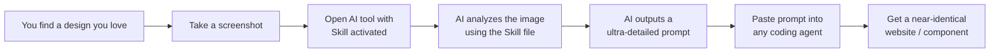

# Replica

> **Turn any design screenshot into a production-ready prompt for any AI coding agent.**

Replica is a curated collection of **AI Skill files** that teach large language models (Claude, ChatGPT, Hermes Agent, Manus, Genspark, and more) how to analyze design images and generate ultra-detailed, developer-grade prompts. Feed it a screenshot — get back a spec so precise that any coding agent (Lovable, Bolt, Replit, Cursor, Windsurf, v0) can rebuild the design pixel-for-pixel.

---

## 🎯 What Is This?

Modern AI tools support **Skills** — structured `.md` files that act as system instructions. When activated, they teach the AI a specific capability. This repository contains a library of such skills, with the flagship being the **Landing Page Prompt Generator**.



---

## 🧠 The Core Skill: Landing Page Prompt Generator

This is the hero skill of the collection. It transforms the way you go from visual inspiration to working code.

### What It Does

When you upload a screenshot of **any** hero section or landing page design and activate this skill, the AI will:

- **Deconstruct** every visual element — layout, background, navbar, typography, colors, spacing, animations
- **Identify** exact fonts (Google Fonts names, weights, fallbacks)
- **Extract** colors as precise hex codes
- **Quantify** every animation with `initial`, `animate`, `delay`, `duration`, and easing values
- **Catalog** all components with Tailwind classes, CSS custom properties, and file structure
- **Output** a complete, copy-paste-ready prompt that any AI coding agent can execute without guesswork

### Example Output

Instead of getting a vague _"create a nice navbar with a button"_, this skill produces prompts like:

> **Navbar Component** (`src/components/Navbar.tsx`)
>
> Wrapper: `<nav className="flex items-center justify-between py-6 px-6 md:px-10 w-full relative z-10">`
>
> CTA Button: `<motion.button whileHover={{ scale: 1.02 }} whileTap={{ scale: 0.98 }}>` with classes `flex items-center bg-[rgba(30,50,90,0.8)] text-white rounded-full pl-2 pr-4 md:pr-6 py-1.5 md:py-2 gap-2 md:gap-3 hover:bg-[rgba(30,50,90,1)] transition-colors group`

The output is so detailed that a junior developer — or any AI coding agent — can rebuild the exact design immediately.

---

## 📋 Complete Skill Inventory

The repository contains **35+ skills** organized into bundles:

### 🎨 Design & UI Skills (17)

| Skill | Description |
|-------|-------------|
| `brainstorming` | Structured brainstorming for design ideation |
| `design-taste-frontend` | Anti-slop frontend skill for landing pages & portfolios |
| `design-taste-frontend-v1` | Original v1 taste skill (legacy) |
| `emil-design-eng` | Emil Kowalski's UI polish & animation philosophy |
| `frontend-design` | General frontend design best practices |
| `gpt-taste` | Elite UX/UI & GSAP Motion engineering |
| `high-end-visual-design` | Premium agency-level visual design standards |
| `image-to-code` | Convert design images directly to code |
| `imagegen-frontend-mobile` | Mobile app screen concept generation |
| `imagegen-frontend-web` | Web design reference generation |
| `impeccable` | UI polish, critique, and refinement |
| `industrial-brutalist-ui` | Raw mechanical Swiss + military terminal aesthetic |
| `minimalist-ui` | Clean editorial-style warm interfaces |
| `redesign-existing-projects` | Upgrade existing sites to premium quality |
| `stitch-design-taste` | Semantic design system for Google Stitch |
| `ui-ux-pro-max` | 50 styles, 21 palettes, 50 font pairings |
| `web-design-guidelines` | General web design standards |

### 🌀 GSAP Animation Skills (8)

| Skill | Description |
|-------|-------------|
| `gsap-core` | GSAP core engine: tweens, timelines, easing |
| `gsap-frameworks` | GSAP integration with frameworks |
| `gsap-performance` | GSAP optimization & performance best practices |
| `gsap-plugins` | GSAP plugin ecosystem |
| `gsap-react` | GSAP with React patterns |
| `gsap-scrolltrigger` | Scroll-driven animations with ScrollTrigger |
| `gsap-timeline` | Advanced timeline sequencing |
| `gsap-utils` | GSAP utility functions & helpers |

### 🖼️ Three.js 3D Skills (8)

| Skill | Description |
|-------|-------------|
| `threejs-fundamentals` | Scene setup, cameras, renderer, math utilities |
| `threejs-geometry` | BufferGeometry, built-in shapes, instancing |
| `threejs-materials` | All material types (Basic through Physical) |
| `threejs-lighting` | Light types, shadows, IBL, light probes |
| `threejs-animation` | Animation system, clips, mixers, morph targets |
| `threejs-interaction` | Raycaster, controls, selection, drag & drop |
| `threejs-loaders` | GLTF, OBJ, FBX, texture loading, Draco/KTX2 |
| `threejs-postprocessing` | EffectComposer, bloom, DOF, SSAO, custom passes |
| `threejs-shaders` | ShaderMaterial, GLSL, uniforms, vertex/fragment shaders |
| `threejs-textures` | TextureLoader, HDR, render targets, PBR sets |

---

## 🚀 How to Use (Workflow)

### The 4-Step Replica Workflow

```
┌──────────────────────────────────────────────────────────────┐
│                                                              │
│  1.  FIND OR CAPTURE A DESIGN YOU LOVE                       │
│      ───────────────────────────────                         │
│      • Browse Dribbble, Behance, Awwwards, Pinterest         │
│      • Take a screenshot of any hero section or landing page │
│      • Use full-page screenshots for best results            │
│                                                              │
│              ▼                                               │
│                                                              │
│  2.  OPEN AN AI TOOL WITH THE SKILL ACTIVATED                │
│      ───────────────────────────────────────────             │
│      • Claude Code / Claude Desktop                          │
│      • ChatGPT with custom GPT + skill file                  │
│      • Hermes Agent (native skill support)                   │
│      • Manus / Genspark / any AI with file context           │
│                                                              │
│              ▼                                               │
│                                                              │
│  3.  PASTE YOUR SCREENSHOT AND LET THE AI ANALYZE IT         │
│      ──────────────────────────────────────────────          │
│      • The AI reads the Skill file → learns the template     │
│      • Analyzes every pixel of your screenshot               │
│      • Outputs a complete engineering-grade prompt           │
│                                                              │
│              ▼                                               │
│                                                              │
│  4.  COPY THE PROMPT INTO ANY CODING AGENT                   │
│      ────────────────────────────────────────────            │
│      • Lovable / Bolt / Replit Agent                         │
│      • Cursor / Windsurf / GitHub Copilot                    │
│      • v0 by Vercel / Claude Artifacts                       │
│      • Any AI that can generate code from prompts            │
│                                                              │
└──────────────────────────────────────────────────────────────┘
```

### Quick Start

```bash
# 1. Clone the repo
git clone https://github.com/your-username/replica.git

# 2. Choose your skill file
#    For the Landing Page Prompt Generator:
#    → skills-list/agents/skills/landing-page-prompt-generator/

# 3. Load the skill into your AI tool's context
#    (See "Where to Install" section below for tool-specific instructions)

# 4. Upload a design screenshot and say:
#    "Generate a detailed prompt from this design"

# 5. Take the output prompt and paste into your favorite coding agent
```

---

## 🤖 Compatible AI Tools

Replica skill files work with any AI tool that supports system instructions, custom prompts, or skill files. Here's how to use them with each platform:

| Tool | How to Load a Skill File | Best For |
|------|--------------------------|----------|
| **Claude Code** | Place the skill in `.claude/skills/` directory or load via `skill` tool | Terminal-based development |
| **Claude Desktop** | Use the Skills directory or attach the `.md` file in the conversation | Chat-based design analysis |
| **ChatGPT (Custom GPTs)** | Create a Custom GPT → upload the skill `.md` file as knowledge | Accessible anywhere |
| **Hermes Agent** | Native `.md` skill support via `ultra-prompt-generator` pipeline | Structured agent workflows |
| **Manus** | Attach the skill file to the conversation context | Autonomous task execution |
| **Genspark** | Upload as a custom Spark / instruction file | Research + design synthesis |
| **Cursor** | Place in `.cursor/rules/` directory | In-editor code generation |
| **Windsurf** | Add as a custom rule or attach to context | AI-assisted development |
| **v0 by Vercel** | Paste the skill content into the system prompt | Rapid prototyping |
| **GitHub Copilot** | Add to `.github/copilot-instructions.md` | In-editor pair programming |
| **Replit Agent** | Include skill file in the Repl's file tree | Full-stack generation |
| **Bolt / Lovable** | Paste prompt output directly (no skill file needed) | Visual app generation |

> **For tools that don't support skill files natively:** Simply copy the contents of the `GUIDE.md` or `SKILL.md` file and paste it as a system instruction before uploading your design screenshot. The AI will follow the instructions just as effectively.

---

## 🔌 How to Activate on Each Platform

### Claude Code

```bash
# Option 1: Place skill file in the skills directory
cp skills-list/agents/skills/landing-page-prompt-generator/GUIDE.md .claude/skills/
# Then activate in conversation:
# > Use the landing-page-prompt-generator skill

# Option 2: Load via skill tool in conversation
# > /skill landing-page-prompt-generator
```

### ChatGPT (Custom GPT)

1. Go to **Explore GPTs** → **Create a GPT**
2. In the **Instructions** field, paste the entire `SKILL.md` content
3. Upload design screenshots in the chat
4. The GPT will follow the skill's instructions automatically

### Cursor / Windsurf

1. Copy the skill `.md` file into `.cursor/rules/` or `.windsurf/rules/`
2. Reference it in your conversation: _"Use the landing page prompt generator skill"_

### Hermes Agent (Native)

Hermes Agent has native RAG support for skill files. Load any skill via:
```python
skill_view(name="landing-page-prompt-generator")
```

---

## 💡 Pro Tips & Best Practices

### For Best Results

- **Use high-resolution screenshots** — the AI can extract fonts, colors, and spacing more accurately
- **Capture full sections** — a full landing page screenshot yields a complete prompt; a hero-only screenshot yields a focused prompt
- **Include the cursor** — some AIs can reverse-engineer hover states from button cursor styles
- **Crop tightly** — remove browser chrome, bookmarks bar, and unrelated UI

### Which Skill Should You Use?

| If you want to... | Use this skill |
|-------------------|----------------|
| Generate a prompt from any design screenshot | `landing-page-prompt-generator` |
| Polish an existing UI design | `impeccable` / `high-end-visual-design` |
| Add scroll-driven animations | `gsap-scrolltrigger` / `gsap-core` |
| Build 3D scenes | `threejs-fundamentals` + relevant specialty |
| Redesign an existing project | `redesign-existing-projects` |
| Create a brutalist / industrial aesthetic | `industrial-brutalist-ui` |
| Generate a minimalist editorial design | `minimalist-ui` |
| Level up your prompt quality | Follow the 15 **Critical Rules** in `SKILL.md` |

### Prompt Output Best Practices

1. **Always use the prompt output immediately** — the generated prompt is timestamp-specific to your design
2. **Feed the prompt to a coding agent** — don't try to hand-code from it; the prompt is optimized for AI consumption
3. **Iterate** — if the result isn't perfect, refine the prompt or try a different coding agent
4. **Mix skills** — use `landing-page-prompt-generator` for the base prompt, then add `gsap-scrolltrigger` for animations

---

## 📁 Repository Structure

```
replica/
├── README.md                          ← You are here
├── skills-list/
│   └── agents/
│       └── skills/
│           ├── _skills-index.md        ← Master index of all skills
│           │
│           ├── brainstorming/          ← Design ideation skill
│           ├── design-taste-frontend/  ← Anti-slop frontend design
│           ├── emil-design-eng/        ← Polish & animation philosophy
│           ├── frontend-design/        ← General frontend best practices
│           ├── gpt-taste/              ← Elite UX/UI & GSAP motion
│           ├── high-end-visual-design/ ← Premium agency visual design
│           ├── image-to-code/          ← Image → direct code conversion
│           ├── imagegen-frontend-mobile/  ← Mobile app screen gen
│           ├── imagegen-frontend-web/  ← Web design reference gen
│           ├── impeccable/             ← UI polish & critique
│           ├── industrial-brutalist-ui/ ← Raw industrial aesthetic
│           ├── minimalist-ui/          ← Clean editorial design
│           ├── redesign-existing-projects/ ← Upgrade existing sites
│           ├── stitch-design-taste/    ← Google Stitch design system
│           ├── ui-ux-pro-max/          ← 50-style design intelligence
│           ├── web-design-guidelines/  ← Design standards
│           │
│           ├── gsap-core/              ← GSAP core engine
│           ├── gsap-frameworks/        ← GSAP framework integration
│           ├── gsap-performance/       ← GSAP optimization
│           ├── gsap-plugins/           ← GSAP plugin ecosystem
│           ├── gsap-react/             ← GSAP + React
│           ├── gsap-scrolltrigger/     ← Scroll-driven animations
│           ├── gsap-timeline/          ← Timeline sequencing
│           ├── gsap-utils/             ← GSAP utilities
│           │
│           ├── threejs-animation/      ← 3D animation system
│           ├── threejs-fundamentals/   ← Three.js core concepts
│           ├── threejs-geometry/       ← Geometry & BufferGeometry
│           ├── threejs-interaction/    ← Raycaster & controls
│           ├── threejs-lighting/       ← Light types & shadows
│           ├── threejs-loaders/        ← Model & texture loading
│           ├── threejs-materials/      ← Material library
│           ├── threejs-postprocessing/ ← Post-processing effects
│           ├── threejs-shaders/        ← GLSL & custom shaders
│           └── threejs-textures/       ← Texture pipeline
```

---

## 🛠️ Contributing

Contributions are welcome! If you have a design skill, prompt engineering technique, or improvement to share:

1. Fork the repository
2. Create a new skill directory under `skills-list/agents/skills/`
3. Add a `GUIDE.md` with YAML frontmatter (`name` + `description`)
4. Follow the existing skill format and structure
5. Submit a Pull Request

### Skill File Format

Every skill follows this structure:

```yaml
---
name: your-skill-name
description: What this skill does and when to use it
---

# Skill Title

## HOW TO USE THIS SKILL

[Step-by-step instructions for the AI to follow]
```

---

## 📄 License

MIT — Use freely, modify, share, and build upon.

---

<p align="center"><b>Replica</b> — Because great designs deserve to be replicated, not just admired.</p>
